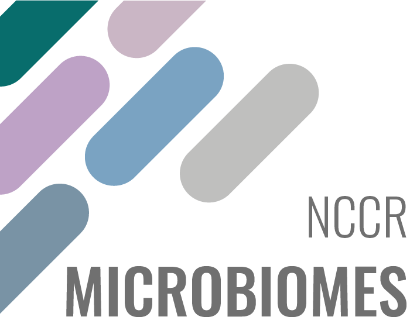

# Spring School Bioinformatics and computational approaches in Microbiology

&nbsp;&nbsp;&nbsp;&nbsp;&nbsp;&nbsp;&nbsp;&nbsp;&nbsp;&nbsp;&nbsp;&nbsp;&nbsp;&nbsp;
  

# Overview
This Spring School is co-organized by the [NCCR AntiResist](https://www.nccr-antiresist.ch/en/), [NCCR Microbiomes](https://nccr-microbiomes.ch/) and the [SIB PhD Training Network](https://www.sib.swiss/training/who-can-benefit#for-phd-students).
The goal of this joint School is to provide PhD students and postdocs with theoretical and mostly hands-on knowledge on selected topics about microbiome and antibiotics resistance. In particular, the participants will be split into four groups to work on mini-projects, which will address the following topics:

* Project 1: Modeling antibiotic resistance evolution.
* Project 2: Computational image analysis: transforming images into insights.
* Project 3: Profiling and modeling the colorectal cancer microbiome.
* Project 4: Mathematical modeling of bacterial metabolism.

# Audience
This course is addressed to life scientists (mostly PhD students and Postdocs) dealing with microbiology topics such as microbiomes and resistance to antibiotics.

# Learning outcomes
At the end of the course, the participants are expected to:

* have a good understanding of the most common methods used during the event;
* repeat the same type of analysis achieved during the mini-project;
* present the mini-project and more globally disseminate their experience to the members of their group.

# Projects details

**Project 1: Modeling antibiotic resistance evolution.** 

* Trainer: **Fernanda Pinheiro**, Group Leader in the [Computational Biology Research Centre, Human Technopole](https://humantechnopole.it/en/research-groups/pinheiro-group/), Milan;
* Trainer: **Leon Seeger**, PhD student enrolled in the lab of Fernanda Pinheiro and Michael Lässig - University of Cologne.
* Description: Bacterial growth under antibiotic challenge results from a complex interplay between antibiotic chemistry, nutrient conditions, bacterial physiology, and evolution. While antibiotics disrupt essential cellular processes of the wild-type susceptible background, they are less harmful to resistant bacteria. Resistant bacteria have multiple ways to counteract antibiotic action, including upregulation of its targets, alteration of membrane permeability, overexpression of efflux pumps, and enzymatic modification of antibiotics. How do different resistance mechanisms shape dosage-dependent bacterial growth? And what determines prevalent mechanisms of resistance evolution as a function of environmental conditions?
In this course, we will build fitness models to characterize the dosage-dependent growth of antibiotic-resistant mutants. We will integrate the biophysics of drug action and antibiotic resistance mechanisms into coarse-grained models of cell metabolism to establish a mechanistic description of bacterial growth under challenge. We will then fit these models to existing data of dosage-response curves and map the conditions for the onset of different resistance mechanisms from the inferred biophysical parameters. Can we predict mechanisms of resistance evolution as a function of conditions?
The lectures will expose the participants to theoretical developments (systems biology models of bacterial growth, metabolic fitness landscapes, evolutionary models), and numerical work will be done in MatLab or Python.

**Project 2: Computational image analysis: transforming images into insights.**

* Trainer: **Simon van Vliet**, Project Leader, [Biozentrum, University of Basel](https://www.biozentrum.unibas.ch/research/research-groups/project-leaders-a-z/overview/unit/research-group-simon-van-vliet) & [NCCR AntiResist](https://www.nccr-antiresist.ch/en/) member;
* Trainer: **Alma Dal Co**, associate professor, [Departement of Computational Biology, University of Lausanne](https://www.unil.ch/dbc/home/menuinst/research-groups/alma-dal-co.html) and [NCCR Microbiomes](https://nccr-microbiomes.ch/) member.
* Description: In natural environments, bacteria are often exposed to environments that change in time or space. Moreover, even in well-mixed clonal populations, bacteria can show dramatic variation in their growth, gene expression, and physiology. A main goal in current research is to study how these effects affect the growth and activity of microbial populations. To address these questions, many research groups are using in-vitro systems, such as agar pads and microfluidic devices, together with time-lapse microscopy to follow cell growth and gene expression in microbial populations at the single cell level. Although these experiments yield rich datasets, extracting biological insight from them can be challenging. 
 In this course, participants will learn how to obtain biological insight from single-cell resolution, time-lapse microscopy data. We will cover all aspects of the image and data analysis workflow: from preprocessing, to segmenting and tracking cells, to feature extraction and statistical analysis. The participant will be introduced to a number of commonly used and state-of-the art tools, including imageJ, Ilastik, SciPy, and Deep Learning based workflows. 
 The projects will focus on gaining hands-on experience: participants will work through a full image analysis workflow. In addition, we will give short lectures to introduce participants to alternative tools and other useful resources. At the end of the course, participants should be able to successfully analyze their own data using a variety of existing analysis tools. 

 Specific knowledge requirements for this project (besides basic knowledge of UNIX and R):  
- Basic programming knowledge in Python / Matlab / R or similar 
- Basic knowledge of statistical methods 

Some familiarity with Python is highly beneficial but not necessary. Participants without prior experience with Python are strongly recommended to follow a short online tutorial before the start of the course (instruction will be provided 3-4 weeks before start of course).

**Project 3: Profiling and modeling the colorectal cancer microbiome.**

* Trainer: **Alessio Milanese**, [Sunagawa Lab - Microbiome Research, ETH Zurich](https://micro.biol.ethz.ch/research/sunagawa.html.) and [SIB](https://www.sib.swiss/scientific-community/research/groups-and-group-leaders/10277-shinichi-sunagawa-s-group). [NCCR Microbiomes](https://nccr-microbiomes.ch/) member;
* Trainer: **Lukas Malfertheiner**, [Von Mering Lab - System Biology, University of Zurich](https://www.mls.uzh.ch/en/research/von-mering) and [SIB](https://www.sib.swiss/christian-von-mering-group). [NCCR Microbiomes](https://nccr-microbiomes.ch/) member;
* Description: Explore different cross-sectional metagenomic studies related to colorectal cancer (CRC), starting from taxonomic profiling to modeling by machine learning. Students will learn to work with metagenomic sequencing data and how to create taxonomic profiles from metagenomic samples using mOTUs [(Milanese et al. 2019)](https://www.nature.com/articles/s41467-019-08844-4). They will use R to explore properties typical for microbiome data (e.g., sparsity and sample size differences), use dimensionality reduction techniques and quantify within- and between-sample diversity. To explore associations between microbes and disease status, students will learn to use the SIAMCAT tool box [(Wirbel et al. 2021)](https://genomebiology.biomedcentral.com/articles/10.1186/s13059-021-02306-1) and develop a model for CRC classification based on taxonomic profiles.

The project requires a basic understanding of the Unix command line and basic programming knowledge in R.

**Project 4: Mathematical modeling of bacterial metabolism: diauxic growth of a population and syntrophic interactions in a consortium**

* Trainer: **Hidde de Jong**, Senior Research Scientist, [INRIA Grenoble](https://team.inria.fr/microcosme/hidde-de-jong/).
* Trainer: **Maaike Sangster**, [INRIA Grenoble](https://team.inria.fr/microcosme/hidde-de-jong/).
* Description: We will step-by-step build simple ODE models of a metabolic network integrating regulation on both the metabolic and gene expression level, and investigate the effect of these layers of regulation on the network dynamics. The course will be structured around two examples: (i) carbon catabolite repression and diauxic growth in bacteria and (ii) synthrophic interactions in a consortium of two bacterial strains. All simulations will be carried out by means of Python.
