# Segmentation and Tracking Mother Machine Data with Bacmman & DistNet

Bacmman is a ImageJ plugin for analyzing mother machine data. All interactions with the software are via a GUI making it relatively user-friendly (though with a bit of a steep learning curve). At the backend Bacmman uses a state-of-the-art deep learning network to track and segment cells.

## Download Data

**Important: the dataset is 5GB big, so start download at latest on Tuesday morning!**

```bash
cd I2ICourse
mkdir Project2C
cd Project2C
wget -O RawData.zip https://drive.switch.ch/index.php/s/nwwP9spbricnFTW/download
unzip -j RawData.zip
```

Check the folder content (it should contain 2 tiff files).  
The remove the zip file with `rm RawData.zip`

## Getting started

Note: parts of this tutorial have been adapted from [this Wiki](https://github.com/jeanollion/bacmman/wiki/DistNet) page of Jean Ollion.

Bacmman is described extensively in this [Nature Protocols article](https://doi.org/10.1038/s41596-019-0216-9), however note that some parts are outdated. Specifically, the protocol uses the older, classical algorithm to track and segment cells. The parts that describe the GUI are still very useful though.  
More up-to-date info can be found on [this wiki](https://github.com/jeanollion/bacmman/wiki).

The Distnet Deep Learning network is described in [this publication](https://arxiv.org/abs/2003.07790).

## Open Bacmman

- Open Fiji
- Go to Plugins -> Bacmman -> Bacteria in Mother Machine Analyzer

## Create a Dataset

### Set working directory

When using Bacmman for the first time choose a working directory.

- Right-click on the panel below `Working Directory` and select `Choose Local Folder`
- make a new folder in `~/I2ICourse/Project2C/Bacmman/` and select this one

### Create new data set

- Click on `Dataset` menu and select `New Dataset from Online Library`
- Select `dataset1_distnet`
- When asked name it Project2C
- Note: after re-opening Bacmann you can re-open the dataset by double clicking on its name in the Dataset field
  
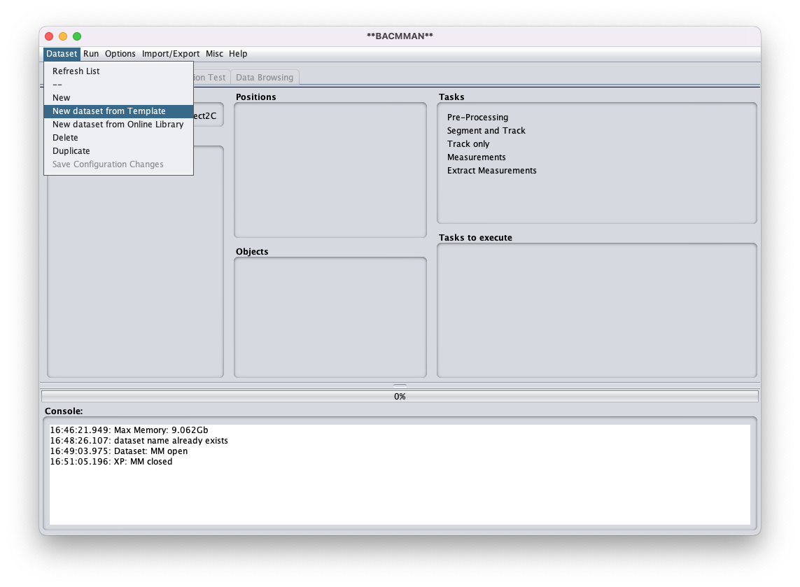

### Adapt configuration file  

- Go to `Configuration tab`
- Right click on `Import Method` and select `One file per Channel & Position`


- The expand the `Pre-Processing Template`
- Go to `Time Step` and set to 7.5 (right click on value to change it). This is the time-interval, in minutes, between frames.


- Click on `Dataset` menu and select `Save configuration changes`

## Add Image Data

- Go to `Home` tab
- Right click in Positions fields and select `Import/re-link images`
- Select the folder containing the Tiff Files: `~/I2ICourse/Project2C/RawData`

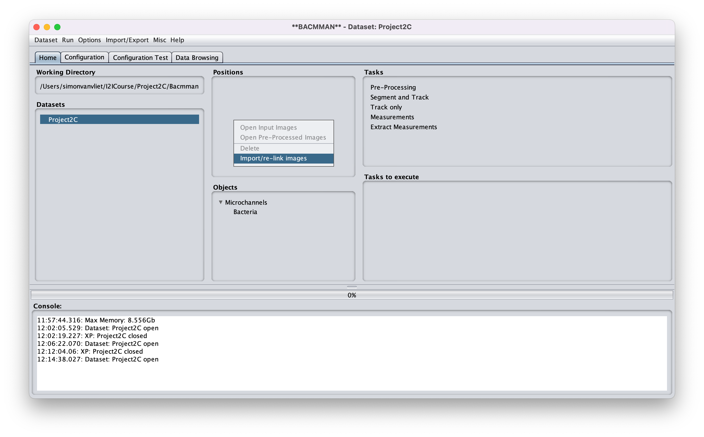

You should now see a list iof tiff images. You can inspect the data by right clicking on an image and select `Open Input images`.

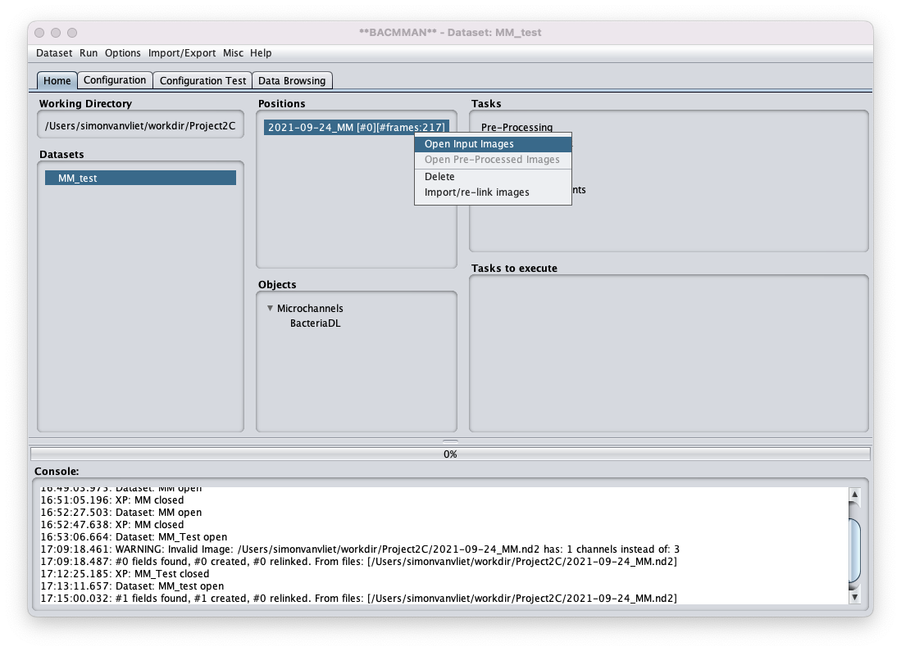

## Define Pre-processing Configuration

### Preprocessing steps

Bacmman needs to do some pre-processing before the Distnet algorithm can segment cells. Specifically:

- Images should be cropped to only contain channels
- Images should be rotated if needed such that channels are vertically aligned
- Images should be flipped if needed such that channels points down

Bacmman provides automated algorithms to do this, these can be adapted to fit your images.
Unfortunately this does not always work. In fact, for our data we have been unable to find settings that work.  
However, we will still show you how to change the automated steps before skipping to manual pre-processing.

### Test automated pre-processing pipeline

- Go to Configuration Test Tab
- In `Step` select `Pre-Processing`
- For speed lets only test a few frames: right click on `Frame Range` and set range from 0 to 5 (you can reduce this further if needed)

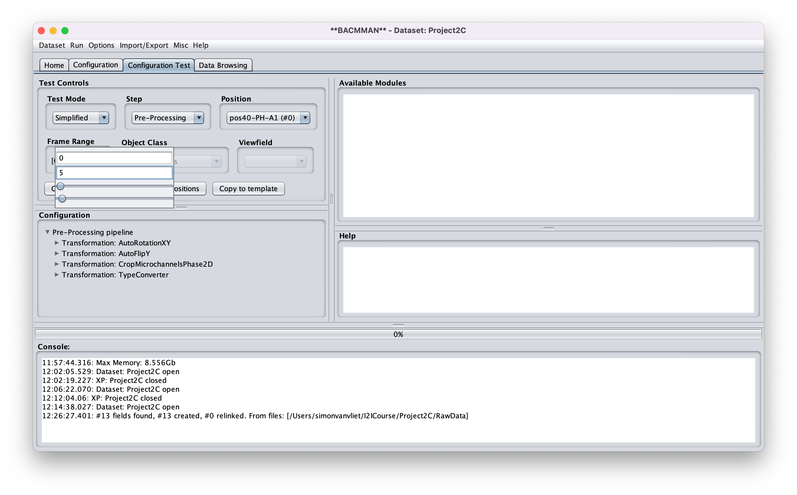

Let's try the AutoFlipY step that flips the microchannels.

- Right click on this step and select `Test Transformation`
  


You can see the result looks bad: our channels were flipped even though they should not have (they should point down).

- Now try to find settings that work. **Important** spend max 5min on this!**
- Hint: you can right click on almost anything in Bacmmann to see and change settings.
- Hint: adapt the micro-channel height (doesn't have to be real length)
- Hint: if that does not work try changing the method

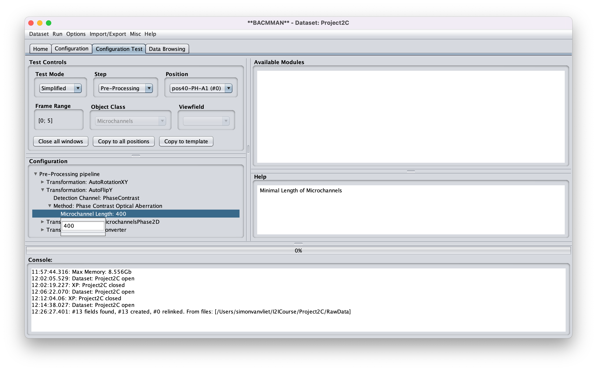

It can be hard to find good settings, and some pre-processing might need to be done by hand. To remove an automated step, right click on it and select `remove`.


You can add new modules. In the top right list are all Available Modules. To add one, right click on `Pre-Processing Pipeline`, this adds a new Transformation. Select this one, and then click on the desired module in the `Available Modules` list.

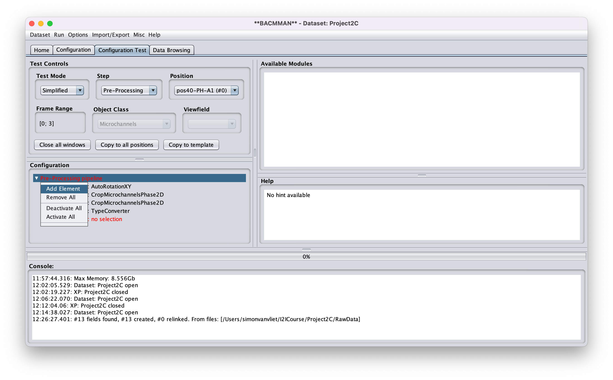

**Now change the config to the one shown in this screenshot:**


- During testing this worked for us, please check!
- Then click on `Copy to all position` and `copy to template`
- Save the configuration via the `Dataset` menu

### Aside: Setup manual pre-processing pipeline

**Do not do this now, we use automated pipeline setup above!**

Sometimes finding automatic settings might be too hard, in that case you can then use manual cropping and flipping as shown in this screen shot:


- With the simple crop option, you need to set the crop box manually for each position.
- Important: for channels that point up, first add a `Flip` step. This should be done before the crop (see screenshot above).
- Test the SimpleCrop first with the default settings, this opens the image without cropping. Now you can draw a bounding box around the channels. Make sure to exclude the exits of the channels where there is a strong phase artifact, at the top keep a bit of space (10-20 pixels) to accommodate stage jitter (see screenshot). Write down the crop-box size and location and enter the numbers in the settings. Repeat this for all positions.
- Keep the full width of the image (do not change x-settings) and only change the y-values (see screenshot)

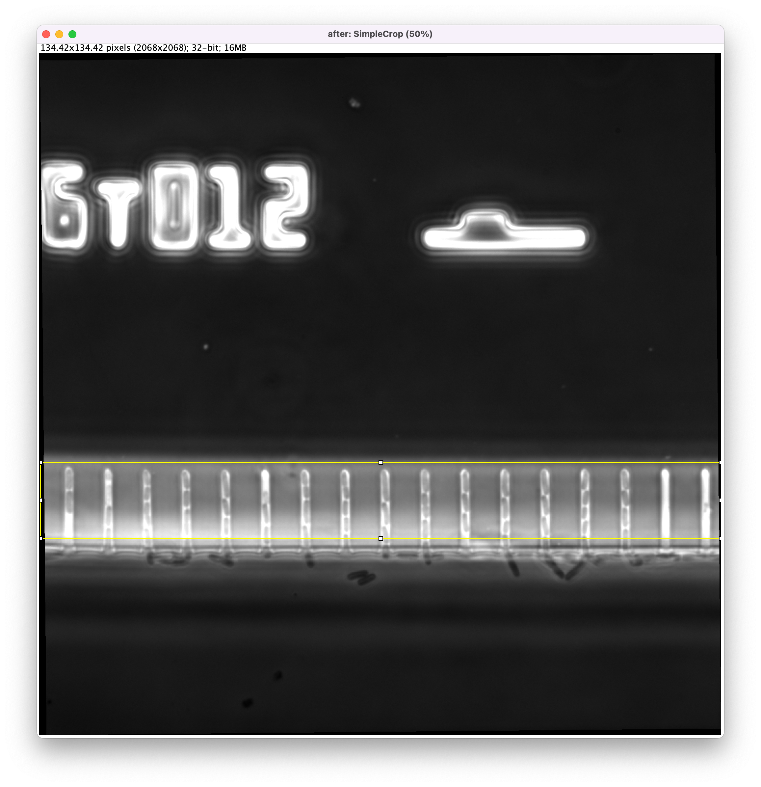


## Run pre-processing pipeline

To run pre-processing

- Select all positions
- Select the task: `Pre-Processing` 
- Choose the menu command `Run > Run Selected Tasks`

This step will take a while.

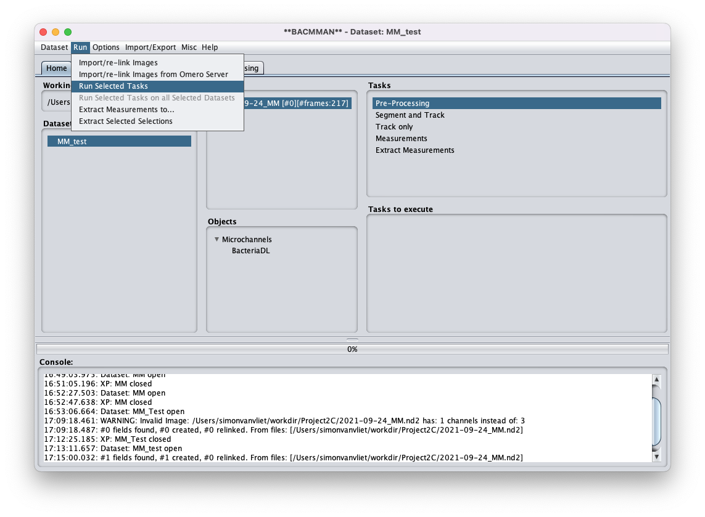

To visualize the pre-processed images right-click on the position and choose `Open Pre-Processed Images`

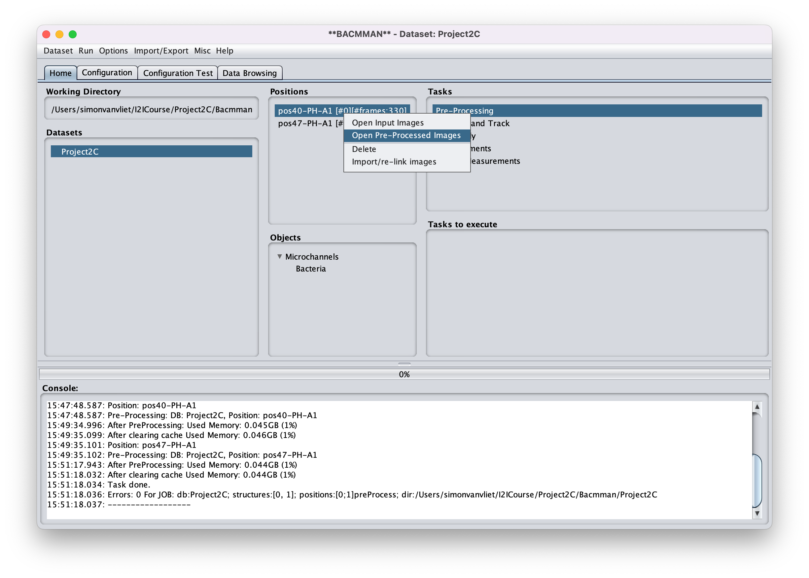

## Configure processing pipeline

The main processing pipeline does not need much configuration: the deep learning network takes care of almost everything.
There are a couple things that we need to do though.

### Download Model Weights

As DiSTNet is a deep-learning based method, it requires trained weights of the model.
To download them (only needed first time you run Bacmman)

- Go to the `Configuration Test` tab
- In the `Step` panel select `Processing`
- In `Object Class` select `Bacteria`
- Unfold the parameters `Tracker` > `Model > Tensorflow Model`. The sub-parameter `Model File` appears in red if the model weights are not there. However it is possible to download them directly from BACMMAN.
- Right-click on `Tensorflow Model` and choose `Download Model`. The model weights will be downloaded at the path selected in the `Model File` parameter, that should not appear in red anymore after the download.


### Adapt channel width

- Go to the `Configuration Test` tab
- In the `Step` panel select `Processing`
- In `Object Class` select `microchannels`
- Set the channel width (in pixels) to the range seen in the data

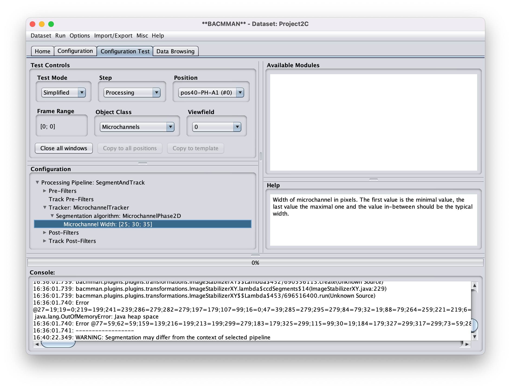

## Run tracking and segmentation

- Go back to the `Home` tab
- Select the objects `Microchannels` and `Bacteria` at the same time
- Select the task: `Segmentation & Tracking`
- Choose the menu command `Run > Run Selected Tasks`

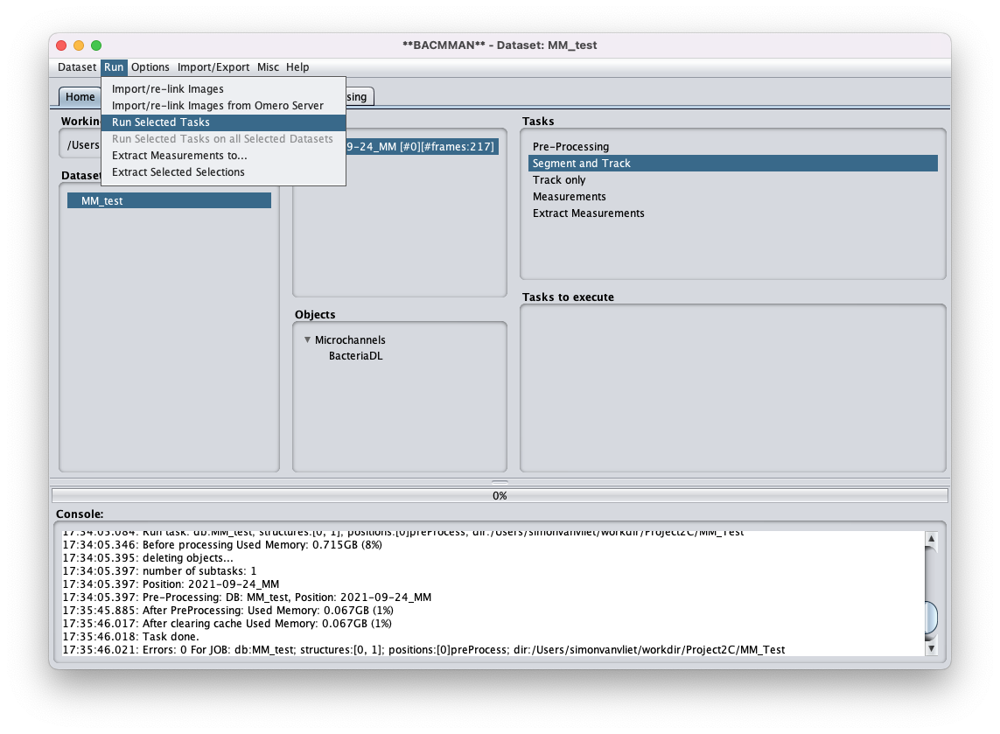

## Check micro-channel segmentation and tracking

To visualize the result of microchannel segmentation and tracking:

- Go to the `Data Browsing` tab
- Right-click on the position and choose `Open Hyperstack > Microchannels`


The pre-processed images will open as a interactive hyperstack (multi-channel & multi-frames image stack), on which microchannels can be selected.

- To display all segmented microchannels object use the shortcut `crtl + A`
- To display all microchannels tracks use the shortcut `crtl + Q`. Tracks will be displayed as colored contours, each color corresponding to one track.
- Note that the shortcut are available from the menu `Help > Display Shortcut table` and that a shortcut preset adapted for QWERTY keyboards can be chosen from the menu `Help > Shortcut Presets`

## Check bacterial segmentation and tracking

To visualize the result of bacterial segmentation and tracking:

- Go to the `Data Browsing` tab
- Right-click on the position and choose `Open Hyperstack > Bacteria`

The pre-processed images will open as a interactive hyperstack (multi-channel & multi-frames image stack), on which bacteria can be selected.

- To display all segmented bacteria object use the shortcut `crtl + A`
- To display all bacteria tracks use the shortcut `crtl + Q`. Tracks will be displayed as colored contours, each color corresponding to one track.
- Note that the shortcut are available from the menu `Help > Display Shortcut table` and that a shortcut preset adapted for QWERTY keyboards can be chosen from the menu `Help > Shortcut Presets`

Another good way to visualize tracking is to use the Kymograph view:

- In the `Segmentation & Tracking Results` area, click on the arrow next to `Position #0`  to expand the list of micro channels.
- Right-click on a micro-channel and choose `Open Kymograph > Bacteria`
- The resulting image shows a concatenation of the same micro-channel for all time points  
- To display all segmented bacteria object use the shortcut `crtl + A`
- To display all bacteria tracks use the shortcut `crtl + Q`. Tracks will be displayed as colored lines connecting neighboring time points.


## Export the data

- Go to the `Home tab`
- Select the object `Bacteria`
- Select the tasks `Measurements` & `Extract Measurements`
- Choose the menu command `Run > Run Selected Tasks`


## Post-process with Python

We will now **switch to the cloud computers** for the next steps.

### Create project folders on cloud computer

- On the cloud computer, we have to make the project folders:

```bash
cd ~/I2ICourse/
mkdir Project2C
cd Project2C
mkdir ProcessedData
```

### Transfer the data

- Then we have to transfer the data from your local computer to the cloud computer
- Upload the output file of Bacmann to a cloud drive, this file is located in: 
- Create a public share link and copy the address

```bash
cd ~/I2ICourse/Project2C/ProcessedData
wget -O data.zip public_link_to_your_zip_file
unzip -j data.zip
```

### Launch Jupyter Labs

- Next  navigate to the project folder, activate the conda environment, and launch Jupyter Labs:

```zsh
cd ~/I2ICourse/
conda activate i2i_env
jupyter lab
```

- In Jupyter Labs, navigate to `spring_school_bioinformatics_microbiology/projects/project2/Project2C/`
- Then open the `explore_data_bacmman.ipynb` notebook

## Note on data


