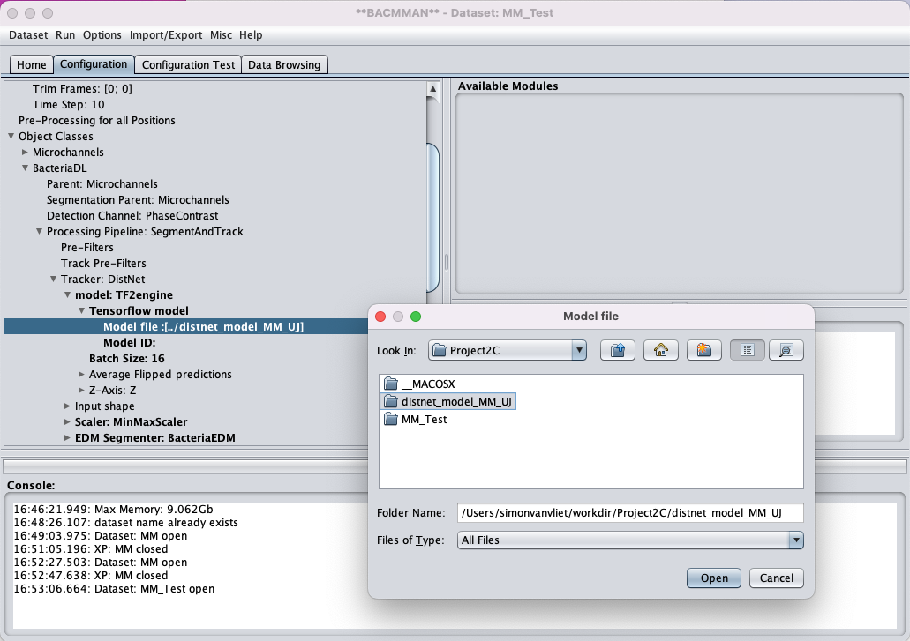
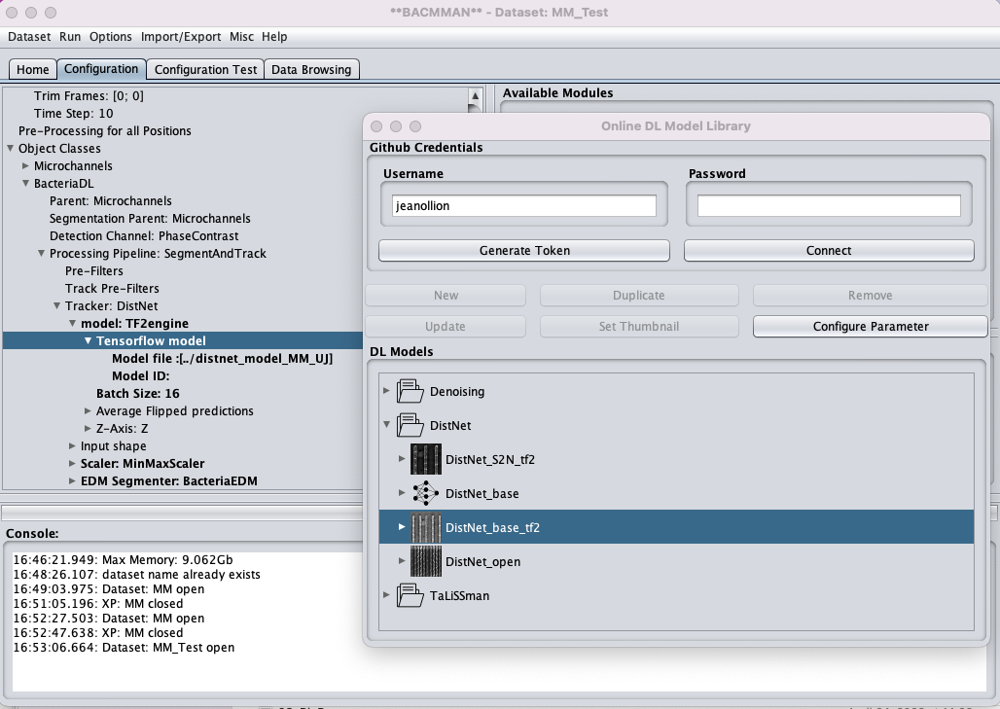
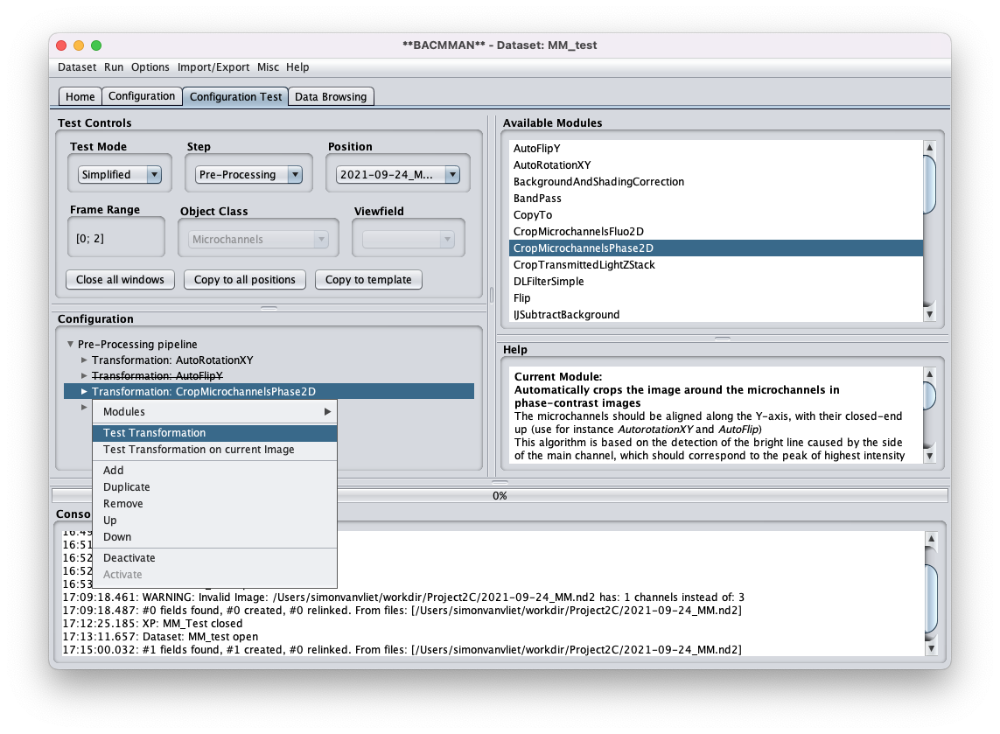
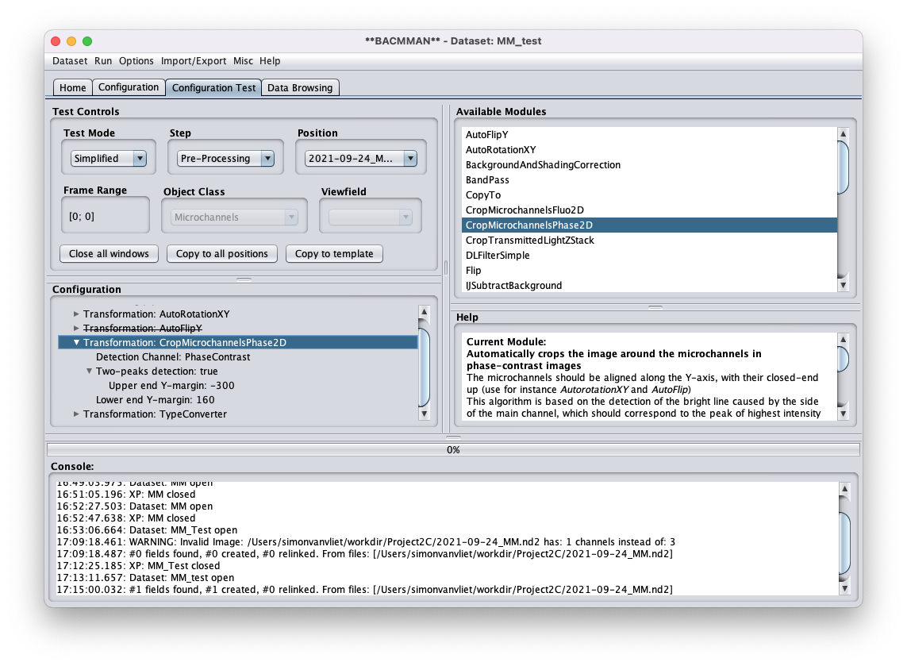

# Segmentation and Tracking Mother Machine Data with Bacmman & DistNet

Bacmman is a [ImageJ](https://imagej.net/software/fiji/) plugin for analyzing mother machine data. All interactions with the software are via a GUI making it relatively user-friendly (though with a bit of a steep learning curve). At the backend Bacmman uses a state-of-the-art deep learning network to track and segment cells.

Bacmman is described extensively in this [Nature Protocols article](https://doi.org/10.1038/s41596-019-0216-9), however note that some parts are outdated. Specifically, the protocol uses the older, classical algorithm to track and segment cells. The parts that describe the GUI are still very useful though.  
More up-to-date info can be found on [this wiki](https://github.com/jeanollion/bacmman/wiki).

The Distnet Deep Learning network is described in [this publication](https://arxiv.org/abs/2003.07790).

Note: parts of this tutorial have been adapted from [this Wiki](https://github.com/jeanollion/bacmman/wiki/DistNet) page of Jean Ollion, on these wiki pages you can also find additional information and tutorials.

## Note on analysis

Analyzing imaging data is computationally intensive and can take a long time depending on the available computer power.
Normally you would run Bacmman on a powerful workstation, ideally one with a CUDA enabled GPU.  
Unfortunately we do not have access to such a workstation during the course, therefore we will demonstrate how the pipeline works using a small sample of our dataset. The rest of the dataset we analyzed before the start of the course, and we will provide you with the results.

## Note on data

Our dataset consist of *Pseudomonas aeruginosa* cells growing in a Mother Machine flow-cells. The cells were exposed to a fluctuating environnement were both the type and availability of nutrients was changed. During the first 12h of the experiments the media had a high amount of a [gluconeogenic](https://en.wikipedia.org/wiki/Gluconeogenesis) carbon source, for the next 12h the media contained no carbon source at all (starvation conditions), for the final 12h the media contained a high amount of a [glycolytic](https://en.wikipedia.org/wiki/Glycolysis) carbon source.

The cells cary two transcriptional reporters: the first (channel 1, RFP) reports on the expression of the glycolytic pathways, the second (channel 2, GFP) reports on the expression level of gluconeogenic pathways.

Images were taken every 10 minutes. The nutrient switches happened after 12h (frame 72) and 24h (frame 144). We have data for 54 positions.

The data was kindly provided by Hector Hernandez of the Urs Jenal lab of the Biozentrum of the University of Basel.

---

## Download Image and Model Data

On your local machine, open the command line and enter the following command to make a project folder

```bash
cd I2ICourse
mkdir Project2C
```

Then download the image data and pre-trained DL network using:

```bash
cd Project2C
wget -O RawData.zip https://drive.switch.ch/index.php/s/GPOQL4yrghaEmHS/download
unzip RawData.zip
```

Check the folder content (use `ls`), it should contain the following items:

- `2021-09-24_MM.nd2`: the imaging data in Nikon `.nd2` format
- `MM_ph_config.json`: configuration file (only phase contrast)
- `MM_UJ_config.json`: configuration file (including fluorescence)
- `distnet_model_MM_UJ` folder, containing the pre-trained DL model
  
- After checking, remove the zip file using `rm RawData.zip`

---

## Create experiment in Bacmman

### Open Bacmman

- Open Fiji
- Go to Plugins -> Bacmman -> Bacteria in Mother Machine Analyzer

### Set working directory

When using Bacmman for the first time choose a working directory.

- Right-click on the panel below `Working Directory` and select `Choose Local Folder`
- Select the `~/I2ICourse/Project2C/` folder

### Create new data set

- Click on `Dataset` menu and select `New Dataset from Template`
- Select the template file located in `~/I2ICourse/Project2C/MM_ph_config.json`
- When asked give the dataset the name `MM_test`
- Note: after re-opening Bacmann you can re-open the dataset by double clicking on its name in the Dataset field
  


### Add image data

- Go to `Home` tab
- Right click in Positions fields and select `Import/re-link images`
- In the popup window select the `~/I2ICourse/Project2C/2021-09-24_MM.nd2` file


You should now see a list of positions (only 1 in this case).  
You can inspect the data by right clicking on an image and select `Open Input images`.


---

## Adapt configuration file  

### Set time-interval

- Go to the `Configuration` tab
- Expand the `Pre-Processing Template`
- Go to `Time Step` and set to 10 (right click on value to change it). This is the time-interval, in minutes, between frames.
- Click on `Dataset` menu and select `Save configuration changes` to save changes


### Load model weights of Deep-learning network

As DiSTNet is a deep-learning based method, it requires trained weights of the model.  
Here we use a refined model that was trained specifically for *Pseudomonas*.

- Go to the `Configuration` tab
- Expand `Object Classes`
- Expand `BacteriaDL`
- Expand `Processing Pipeline: SegmentAndTrack`
- Expand `Tracker: Distnet`
- Expand `Model: TF2engine`
- Expand `Tenserflow model`
- Right click on `Model file` in the popup window select the `distnet_model_MM_UI` folder and click `Open`



### Aside: download default model for E. coli

**Do not do this step now** we use the model selected above.

If you do not work with *Pseudomonas*, it is best to use the default DiSTNet model weights. You can download them directly from within Bacmman.

- Follow the steps above until you get to `Tenserflow model file`
- Now right click on `Tenserflow model file` and select `Configure from library`
- In the popup window, select `DistNet_base_tf2` and select `Configure Parameter`



---

## Define and run Pre-processing pipeline

### Preprocessing steps

Bacmman needs to do some pre-processing before the Distnet algorithm can segment cells. Specifically:

- Images should be cropped to only contain channels
- Images should be rotated if needed such that channels are vertically aligned
- Images should be flipped if needed such that channels points down

Bacmman provides automated algorithms to do this, these can be adapted to fit your images.
Unfortunately this does not always work, at the end of this document we give some hints on how to optimize settings.

### Test automated pre-processing pipeline

- Go to Configuration Test Tab
- In `Step` select `Pre-Processing`
- For speed lets only test a few frames: right click on `Frame Range` and set range from 0 to 0.


Let's try the `CropMicroChannelsPhase2D` step that crops the microchannels.

- Right click on this step and select `Test Transformation`
  


You can see there is a lot of space at the top. We can reduce this a bit, keeping a margin of ~50 pixel.

- Now try to find settings that do this. **Important spend max 5min on this!**
- Hint: click the arrows to expand the `CropMicroChannelsPhase2D` step to see all settings, right click on any number or text to change it.
- Hint: see what effect changing `Upper end Y-margin` has


Ok, hopefully you found settings that worked well, for us `Upper end Y-margin=-300` and `Lower end Y-margin=160` worked well.

- Once you are happy with the settings you can save them via `Save Configuration Changes` in the `Dataset` menu
- You can also copy changes in the configuration to other positions by clicking on `Copy to all position` and you can add it to the template by clicking on `copy to template`. **Important** do not use these options after setting positions specific parameters (such as manual crop or flip transformations)!



### Run pre-processing pipeline

Now we can run the pre-processing pipeline:

- Go to the `Home` tab
- In the `Positions` field select all positions
- In the `Tasks` field select `Pre-Processing`
- In menubar go to `Run` and select `Run Selected Tasks`
- This step can take several minutes


To visualize the pre-processed images right-click on the position and choose `Open Pre-Processed Images`. Make sure that the cropping worked well for all frames.


---

## Run tracking and segmentation

Now we can segment and track the cells:

- Go  to the `Home` tab
- In the `Positions` field select all positions
- In the `Tasks` field select `Segmentat and Track`
- In menubar go to `Run` and select `Run Selected Tasks`
- This step can take several minutes up to even an hour depending on your computers speed, ideally you run this step during a break, but if this is impossible, please check with the Tutors on how best to spend your time while you wait.


---

## Inspect segmentation and tracking results

Now we can check the results of the segmenting and tracking.

### Check micro-channel segmentation and tracking

 To visualize the result of microchannel segmentation and tracking:

- Go to the `Data Browsing` tab
- Right-click on the position and choose `Open Hyperstack > Microchannels`


The pre-processed images will open as a interactive hyperstack (multi-channel & multi-frames image stack), on which microchannels can be selected.

- To display all segmented microchannels object use the shortcut `crtl + A`
- To display all microchannels tracks use the shortcut `crtl + Q`. Tracks will be displayed as colored contours, each color corresponding to one track.
- Note that the shortcut are available from the menu `Help > Display Shortcut table` and that a shortcut preset adapted for QWERTY keyboards can be chosen from the menu `Help > Shortcut Presets`

### Check bacterial segmentation and tracking

To visualize the result of bacterial segmentation and tracking:

- Go to the `Data Browsing` tab
- Right-click on the position and choose `Open Hyperstack > Bacteria`

The pre-processed images will open as a interactive hyperstack (multi-channel & multi-frames image stack), on which bacteria can be selected.

- To display all segmented bacteria object use the shortcut `crtl + A`
- To display all bacteria tracks use the shortcut `crtl + Q`. Tracks will be displayed as colored contours, each color corresponding to one track.
- Note that the shortcut are available from the menu `Help > Display Shortcut table` and that a shortcut preset adapted for QWERTY keyboards can be chosen from the menu `Help > Shortcut Presets`

Another good way to visualize tracking is to use the Kymograph view:

- In the `Segmentation & Tracking Results` area, click on the arrow next to `Position #0`  to expand the list of micro channels.
- Right-click on a micro-channel and choose `Open Kymograph > Bacteria`
- The resulting image shows a concatenation of the same micro-channel for all time points  
- To display all segmented bacteria object use the shortcut `crtl + A`
- To display all bacteria tracks use the shortcut `crtl + Q`. Tracks will be displayed as colored lines connecting neighboring time points.


---

## Extract cell measurements the data

Now that we have segmented and tracked cells, we need to extract cell measurements.

- Go to the `Home tab`
- In the `Objects` field select `BacteriaDL`
- in the `Tasks` field select `Measurements` & `Extract Measurements`
- In menubar go to `Run` and select `Run Selected Tasks`


---

## Post-process with Python

### Export Data on local computer

For the next steps we will switch to the cloud computers, but before that we need to transfer the data-file we just created:

- On your local computer locate the `.csv` file created by Bacmman, you can find it in: `~/I2Icourse/MM_test/MM_test.csv`
- Upload this file to a cloud drive
- Create a public share link and copy the address

### Download data on cloud computer

**Now login to the cloud computer. Reminder: on the cloud computer we need to store all data in the `~/workdir/` folder or sub-folders of this, to make sure that files remain available after restarting the instance.**

- On the cloud computer, navigate to the `workdir` folder and create a `Project2C` subfolder:

```bash
cd ~/workdir/
mkdir Project2C
```

Now we download the data file we just uploaded to the cloud:

```bash
cd Project2C
wget -O MM_test_1.csv public_link_to_your_zip_file
```

### Download the full dataset

In the second notebook, we will analyze the full dataset (X positions) that we prepared before the start of the code.  
Here we download this dataset

- On the cloud computer navigate to the project folder and download the data using `wget`:

```bash
cd ~/workdir/Project2C
wget -O cell_data_all.csv https://drive.switch.ch/index.php/s/DiXnrjTmySyXYzl/download
ls 
```

You now should have the `cell_data_all.csv` file in your project folder.

### Launch Jupyter Labs

- On the cloud computer navigate to the `~/workdir/` folder, activate the conda environment, and launch Jupyter Labs:
**Important: on the cloud computer use `conda activate project2` instead!**

```bash
cd ~/workdir/
conda activate i2i_env
jupyter lab
```

- In Jupyter Labs, navigate to `spring_school_bioinformatics_microbiology/projects/project2/Project2C/`

- Then open the `0_postprocess_bacmman.ipynb` notebook and follow the instructions there.

---

## Additional Information - Adapting pre-processing configurations

**Do not do read this now, this is additional information for when you want to use Bacmman with your own data later on**  
One of the hardest parts of setting up Bacmman is to find a pre-processing configurations that works well.
Here we give some details on how to adapt the configuration to your data.  

### Optimize pre-processing pipeline

- Go to Configuration Test Tab
- In `Step` select `Pre-Processing`
- For speed lets only test a few frames: right click on `Frame Range` and set range from 0 to 5 (you can reduce this further if needed)


- To test a step, simply right-click on it and select select `Test Transformation`
  


This will run all transformation up-to and including the selected step and will show you the result.

- Check the result and change the transformation parameters if needed
- Note: you can right click on almost anything in Bacmmann to see and change settings.
- Note: sometimes you have to put in numbers that don't make sense, e.g. to make the AutoFlipY work you might have to set the micro-channel height to a value that is completely different from the actual micro-channel height

It can be hard to find good settings, and some pre-processing might need to be done by hand. To remove an automated step, right click on it and select `remove`.


You can also add new modules. In the top right list are all Available Modules. To add one, right click on `Pre-Processing Pipeline`, this adds a new Transformation. Select this one, and then click on the desired module in the `Available Modules` list.


### Manual pre-processing steps

Sometimes finding automatic settings might be too hard, in that case you can then use manual cropping and flipping as shown in this screen shot:


- With the simple crop option, you need to set the crop box manually for each position.
- Important: for channels that point up, first add a `Flip` step. This should be done before the crop (see screenshot above).
- Note: to set the crop-box, first test the SimpleCrop with the default settings, this opens the image without cropping. Now you can draw a bounding box around the channels. Make sure to exclude the exits of the channels where there is a strong phase artifact, at the top keep a bit of space (10-20 pixels) to accommodate stage jitter (see screenshot). Also make sure that the crop works for all frames (adapt frame range to include all frames).
- Write down the crop-box size and location and enter the numbers in the settings.Keep the full width of the image (do not change x-settings) and only change the y-values (see screenshot)
- Repeat this for all positions.


### Pre-processing outside of Bacmman

Sometime it is also just easier to do some pre-processing before importing data into Bacmman. For example, in case a certain image region (such as channel numbering) interferes with automated cropping, you can first crop the images manually to remove this area (see the Project 2A part for how to crop) and then use the automated cropping on these pre-processed images.  

### Storing configuration

- You can copy changes in the configuration to other positions by clicking on `Copy to all position` and you can add it to the template by clicking on `copy to template`. **Important** do not use these options after setting positions specific parameters (such as manual crop or flip transformations)!
- Save the configuration via the `Dataset` menu
