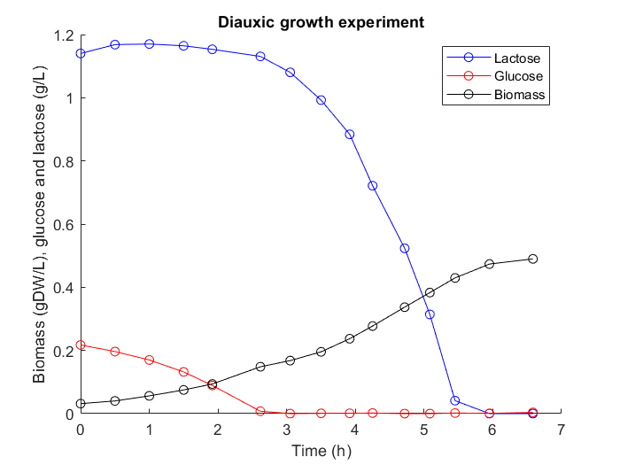
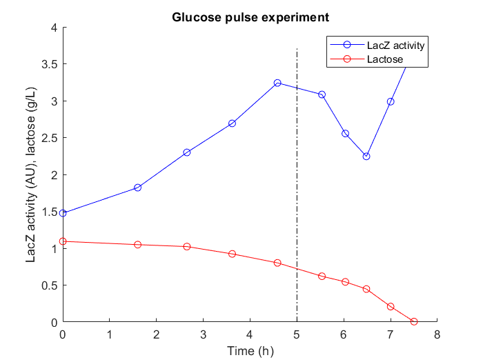
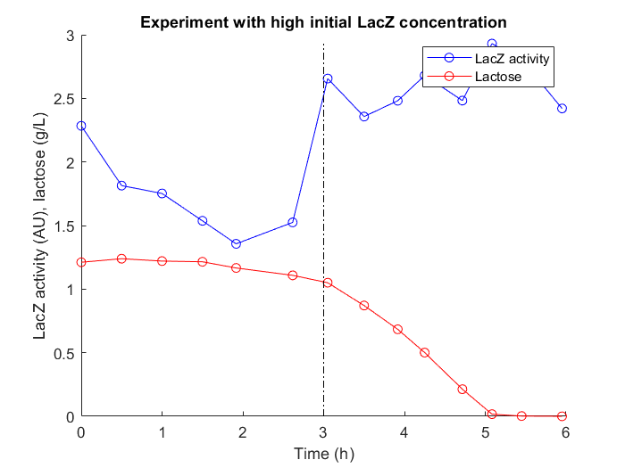

# Project 4A: Diauxic growth in bacteria
## Project assignment
Develop a coarse-grained model that (i) includes a representation of known regulatory mechanisms underlying carbon catabolite repression (CCR) and (ii) reproduces quantitative data and qualitative observations on diauxic growth.
## Biological question to be answered
Which mechanisms are necessary for bringing about diauxic growth?

Known regulatory mechanisms to be included: enzyme induction, inducer exclusion, and global regulation of gene expression by metabolic signal (cAMP).
Quantitative data and qualitative observations to account for:

 - Curves of glucose-lactose diauxie in standard batch conditions with glucose and lactose;

 
 
 - Curves of glucose-lactose diauxie in a batch experiment with a glucose pulse and a batch experiment with a high starting concentration of lactose enzymes;
 

 

 - No growth in the absence of glucose and lactose.
 

 
## Model structure
Environment described by concentrations of biomass (*B*, gDW/L), preferred substrate (*G*, mmol/L) and secondary substrate (*L*, mmol/L) in the bioreactor of constant volume.

$$\frac{dG}{dt} = -v_G B,$$

$$\frac{dL}{dt} = -v_L B,$$

$$\frac{dB}{dt} = \mu B,$$

The growth rate is denoted by $\mu$ (1/h), while $v_G$ and $v_L$ (mmol/(gDW L)) correspond to the uptake rates of glucose and lactose, respectively. In the project, we are going to build a model of the growing bacterial population in this environment.
##Available data
[Csv files](https://www.dropbox.com/sh/tadibbh3wbn5ga9/AAD8-i2_6kdZ8rKNTC3uYXY1a?dl=0) of the three experiments described above. The data originates from K. Bettenbrock et al. A quantitative approach to catabolite repression in Escherichia coli. J Biol Chem. 2006;281:2578–84. Additional comments:

- In the pulse experiment, the glucose pulse occurs at 5 h and LacZ activity is a proxy for the LacZ concentration;
- In the batch experiment with a high starting concentration of lactose enzymes, glucose is depleted at 3 h and LacZ activity is a proxy for the LacZ concentration.

