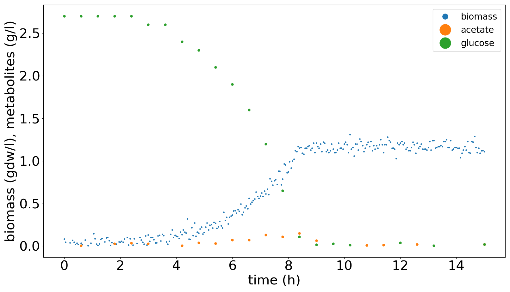
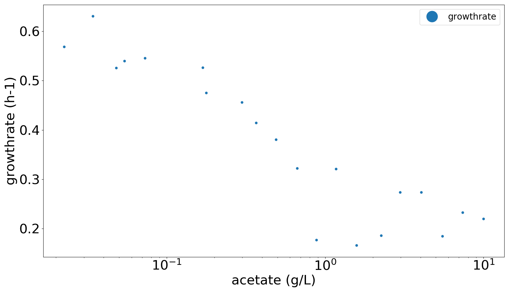
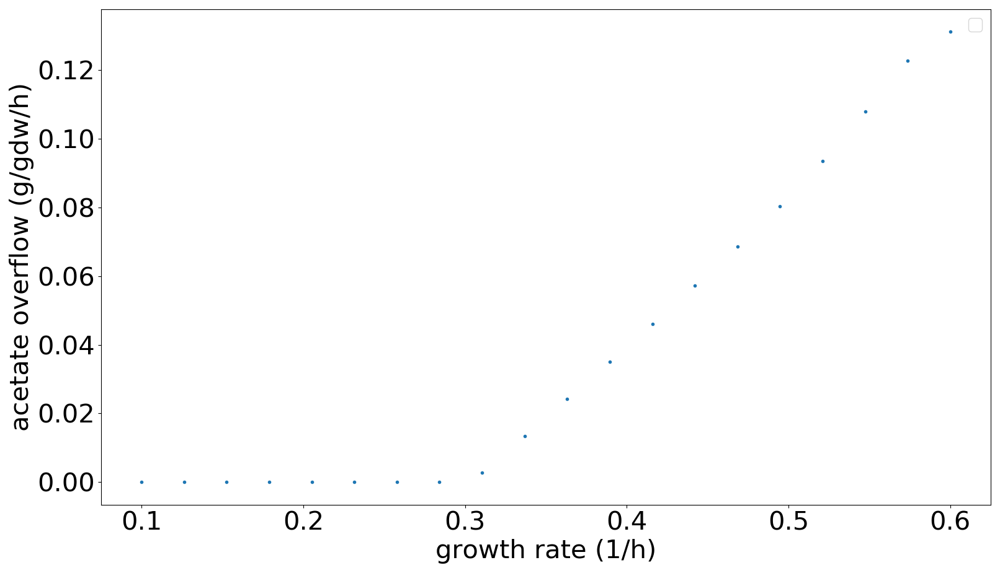
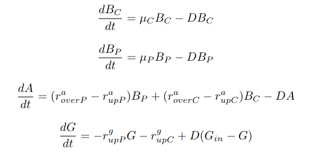

# Project 4B: A syntropic bacterial consortium
## Project assignment
Develop a coarse-grained model that

 - Represents a two strain consortium growing on glucose 
 - Reproduces at least quantitatively the given batch data of a single strain growing on glucose
 
## Biological question to be answered
What are the conditions for co-existence of a two species consortium, growing in a chemostat on glucose?

##Quantitative data and qualitative observations to account for

 - Curves of growth on glucose in standard batch conditions
 - Overflow of acetate during growth on acetate
 - No growth in absence of glucose and acetate 
 
 - Toxicity of acetate
 
 - Optional: dependence of acetate overflow on the glucose uptake rate 
 
 
##Model structure
Environment described by concentrations of biomass (B, gdW/L), glucose (G, g/L) and acetate (A, g/L) in a continuous culture of constant volume.

Where mu is the growth rate (h⁻¹), D is the dilution rate (h⁻¹), r\_over is the overflow rate (g/gDW/h) and r\_up (g/gDW/h) is the uptake rate. 

##Available data

The data are available as csv files on ...
 
 - Strain P growing on glucose in batch
 - The effect of acetate on the growth rate of strain P
 
##Software

To do the modelling, you need to use Python. To solve the system of ODE's you can use scipy.integrate.solve_ivp. To fit the model with the data, you can use lmfit. 
 
    
 
 
 
